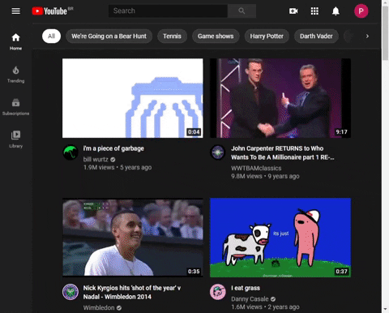

<p align="center">
  
</p>

<p align="center">
  <a href="https://github.com/FanaroEngineering/youtube_kbd_nav/releases"></a>
  <a href="https://gitter.im/youtube_kbd_nav/community"></a>
  <a href="https://github.com/FanaroEngineering/youtube_kbd_nav/actions"></a>
  <a href="https://www.codefactor.io/repository/github/fanaroengineering/youtube_kbd_nav/overview/master"></a>
  <a href="https://www.buymeacoffee.com/psygo"></a>
</p>

---

# YouTube Keyboard Navigation Browser Extension

<p align="center">
  
</p>

<p align="center">
  <sub>The GIF above may not reflect the latest set of features. For example, currently, a decoration for showing if the video element is the active element extists. Check the <a href="#13-available-shortcuts">table of shortcuts</a> below for more info.</sub>
</p>

---

**Table of Contents**

<div id="user-content-toc">
  <ul>
    <li>
      <a href="#1-for-the-user">1. For the User</a>
      <ul>
        <li><a href="#11-releases">1.1. Releases</a></li>
        <li>
          <a href="#12-how-to-install-it-with-a-zip-file"
            >1.2. How to install it with a zip file</a
          >
          <ul>
            <li>
              <a href="#121-from-the-different-stores"
                >1.2.1. From the Different Stores</a
              >
            </li>
            <li><a href="#122-chrome">1.2.2. Chrome</a></li>
            <li><a href="#123-firefox">1.2.3. Firefox</a></li>
            <li><a href="#124-microsoft-edge">1.2.4. Microsoft Edge</a></li>
          </ul>
        </li>
        <li><a href="#13-available-shortcuts">1.3. Available Shortcuts</a></li>
        <li>
          <a href="#14-natively-available-shortcuts-on-youtube"
            >1.4. Natively Available Shortcuts on YouTube</a
          >
          <ul>
            <li><a href="#141-playback">1.4.1. Playback</a></li>
            <li><a href="#142-general">1.4.2. General</a></li>
            <li>
              <a href="#143-subtitle-and-closed-captions"
                >1.4.3. Subtitle and Closed Captions</a
              >
            </li>
            <li><a href="#144-spherical-videos">1.4.4. Spherical Videos</a></li>
          </ul>
        </li>
      </ul>
    </li>
    <li>
      <a href="#2-for-the-developer">2. For the Developer</a>
      <ul>
        <li>
          <a href="#21-future-improvements-development"
            >2.1. Future Improvements (Development)</a
          >
        </li>
        <li>
          <a href="#22-building-with-dart2js"
            >2.2. Building with <code>dart2js</code></a
          >
        </li>
        <li>
          <a href="#23-visualizing-the-extensions-design-with-uml"
            >2.3. Visualizing the Extension&#39;s Design with UML</a
          >
        </li>
      </ul>
    </li>
  </ul>
</div>

---

## 1. For the User

An extension to make navigating possible with only the keyboard.

> Much of the inspiration for this extension comes from the [`web-search-navigator`][web_search_navigator] extension. Though not that well-known, the [`web-search-navigator`][web_search_navigator] is probably the most useful extension I have. The [`web-search-navigator`][web_search_navigator] extension does offer some of this extension's features, but not all &mdash; and anything beyond Google is experimental there.

Do you have any complaints? Or suggestions for improvements? Then [create an issue for this project][issue_page]. Don't forget that YouTube, like Twitter, Reddit and others, already offers some shortcuts. Just press <kbd>Shift</kbd> + <kbd>?</kbd> on YouTube to check out all of the native shortcuts.


[issue_page]: https://github.com/FanaroEngineering/youtube_kbd_nav/issues
[web_search_navigator]: https://github.com/infokiller/web-search-navigator

### 1.1. Releases

Currently, this extension is in its *alpha* stage. Basically, only the first sketch is available to a small amount of users. I expect that, in 1-2 weeks, we will be able to enter a *beta*; and, hopefully, in a month, a first public release on the Chrome Firefox and Edge's extension stores.

You can directly download this extension's files from the [Releases][release_link] page.


[release_link]: https://github.com/FanaroEngineering/youtube_kbd_nav/releases

### 1.2. How to install it with a zip file

#### 1.2.1. From the Different Stores

Choose one of the links below:

| Browser Extension Store |
| ----------------------- |
| [Chrome][chrome]        |
| [Firefox][firefox]      |
| [Edge][edge]            |


[chrome]: https://chrome.google.com/webstore/detail/youtubekbdnav/lfhpmfgaahemloddkjioinadcoighoih?hl=en&authuser=0
[edge]: https://microsoftedge.microsoft.com/addons/detail/youtube-kbd-nav/kagdmnehbppginlkcdeiimdkglafgcji
[firefox]: https://addons.mozilla.org/en-US/firefox/addon/youtube-kbd-nav/

#### 1.2.2. Chrome

1. Unzip the extension in a local folder.
1. Go to [chrome://extensions/][chrome_extensions]
1. Activate <kbd>Developer mode</kbd> on the upper-right corner.
1. Click on <kbd>Load unpacked</kbd> and choose the folder where you unzipped the extension.


[chrome_extensions]: chrome://extensions/

#### 1.2.3. Firefox

1. Go to [about:debugging][about_debugging]
1. Click on <kbd>This Firefox</kbd>.
1. Click on <kbd>Load Temporary Add-on...</kbd> and load the zip file directly.


[about_debugging]: about:debugging

#### 1.2.4. Microsoft Edge

1. Unzip the extension in a local folder.
1. Go to [edge://extensions][edge_extensions]
1. Activate <kbd>Developer mode</kbd> on the lower-left corner.
1. Click on <kbd>Load unpacked</kbd> and choose the folder where you unzipped the extension.


[edge_extensions]: edge://extensions/

### 1.3. Available Shortcuts

If you're a Mac user, replace <kbd>Ctrl</kbd> by <kbd>&#8984;</kbd> &mdash; i.e. <kbd>command</kbd>.

If, due to a mistake, the table below isn't working as expected, go to the [`lib/src/kbd.dart`][kbd_dart] file and examine the `switch` statement to truly get a hold of what's going on.

| Shortcut                           | Action                                                  |
| ---------------------------------- | ------------------------------------------------------- |
| <kbd>Ctrl</kbd> + <kbd>/</kbd>     | Toggle the whole extension<sup>7</sup>                  |
| <kbd>z</kbd>                       | Cycle forwards on the thumbnails                        |
| <kbd>x</kbd>                       | Cycle backwards on the thumbnails                       |
| <kbd>Enter</kbd>                   | Navigate to the selected thumbnail                      |
| <kbd>Ctrl</kbd> + <kbd>Enter</kbd> | Open a new tab for the selected thumbnail               |
| <kbd>q</kbd>                       | YouTube Home                                            |
| <kbd>Ctrl</kbd> + <kbd>q</kbd>     | New Tab to YouTube Home                                 |
| <kbd>h</kbd>                       | YouTube History                                         |
| <kbd>Ctrl</kbd> + <kbd>h</kbd>     | New Tab to YouTube History                              |
| <kbd>e</kbd>                       | Toggle subscription to the channel<sup>1</sup>          |
| <kbd>v</kbd>                       | Like the video<sup>1</sup>                              |
| <kbd>n</kbd>                       | Dislike the video<sup>1</sup>                           |
| <kbd>b</kbd>                       | Copies the shortened URL of the video<sup>2</sup>       |
| <kbd>y</kbd>                       | Opens the notification pop-up                           |
| <kbd>Ctrl</kbd> + <kbd>y</kbd>     | Add video to the watch later<sup>6</sup> playlist       |
| <kbd>Ctrl</kbd> + <kbd>[</kbd>     | Focuses on the comment box<sup>2 \| 3</sup>             |
| <kbd>Ctrl</kbd> + <kbd>]</kbd>     | Toggles the expansion of the description<sup>2</sup>    |
| <kbd>;</kbd>                       | Go to the channel's page<sup>4</sup>                    |
| <kbd>Ctrl</kbd> + <kbd>;</kbd>     | Go to the channel's page on a new tab<sup>4</sup>       |
| <kbd>=</kbd>                       | Go to the video's channel<sup>2</sup>                   |
| <kbd>Ctrl</kbd> + <kbd>=</kbd>     | Go to the video's channel on a new tab<sup>2</sup>      |
| <kbd>\\</kbd>                      | Toggle the video player's focus<sup>5</sup>             |
| <kbd>w</kbd>                       | Toggle Picture-in-Picture (PIP) mode                    |
| <kbd>.</kbd>                       | Go to the Watch Later playlist<sup>8</sup>              |
| <kbd>Ctrl</kbd> + <kbd>.</kbd>     | Go to the Watch Later playlist in a new tab<sup>8</sup> |


<sub>1: Only works when signed-in and on a video page.</sub> \
<sub>2: Only works when on a video page.</sub> \
<sub>3: The comment section needs to be loaded for this to work.</sub> \
<sub>4: Since YouTube doesn't expose the channel's link when you're on a video page, this shortcut won't work on video pages.</sub> \
<sub>5: Changes the decoration of the video player.</sub> \
<sub>6: You actually have to press it twice, once for the popup and another when the popup is on the screen.</sub> \
<sub>7: The extension logo appears right next to YouTube's when the extension is enabled.</sub> \
<sub>8: Once in the Watch Later playlist page, press <kbd>.</kbd> again to play the videos.</sub>


[kbd_dart]: lib/src/kbd.dart

### 1.4. Natively Available Shortcuts on YouTube

#### 1.4.1. Playback

| Shortcut                                                         | Action                                         |
| ---------------------------------------------------------------- | ---------------------------------------------- |
| Toggle play/pause                                                | <kbd>k</kbd>                                   |
| Rewind 10 seconds                                                | <kbd>j</kbd>                                   |
| Fast forward 10 seconds                                          | <kbd>l</kbd>                                   |
| Previous Video                                                   | <kbd>P</kbd> (<kbd>Shift</kbd> + <kbd>p</kbd>) |
| Next Video                                                       | <kbd>N</kbd> (<kbd>Shift</kbd> + <kbd>n</kbd>) |
| Previous Frame (while paused)                                    | <kbd>,</kbd>                                   |
| Next frame (while paused)                                        | <kbd>.</kbd>                                   |
| Decrease playback rate                                           | <kbd><</kbd> (<kbd>Shift</kbd> + <kbd>,</kbd>) |
| Increase playback rate                                           | <kbd>></kbd> (<kbd>Shift</kbd> + <kbd>.</kbd>) |
| Seek to specific point in the video (7 advances to 70% duration) | <kbd>0</kbd>...<kbd>9</kbd>                    |

#### 1.4.2. General

| Shortcut                           | Action         |
| ---------------------------------- | -------------- |
| Toggle full screen                 | <kbd>f</kbd>   |
| Toggle theater mode                | <kbd>t</kbd>   |
| Toggle miniplayer                  | <kbd>i</kbd>   |
| Close miniplayer or current dialog | <kbd>Esc</kbd> |
| Toggle mute                        | <kbd>m</kbd>   |

#### 1.4.3. Subtitle and Closed Captions

| Shortcut                                               | Action       |
| ------------------------------------------------------ | ------------ |
| If the video supports captions, toggle captions ON/OFF | <kbd>c</kbd> |
| Rotate through different text opacity levels           | <kbd>o</kbd> |
| Rotate through different window opacity levels         | <kbd>w</kbd> |
| Rotate through font sizes (increasing)                 | <kbd>+</kbd> |
| Rotate thorugh font sizes (decreasing)                 | <kbd>-</kbd> |

#### 1.4.4. Spherical Videos

| Shortcut  | Action                                 |
| --------- | -------------------------------------- |
| Pan up    | <kbd>w</kbd>                           |
| Pan left  | <kbd>a</kbd>                           |
| Pan down  | <kbd>s</kbd>                           |
| Pan right | <kbd>d</kbd>                           |
| Zoom in   | <kbd>+</kbd> on numpad or <kbd>]</kbd> |
| Zoom out  | <kbd>-</kbd> on numpad or <kbd>]</kbd> |

## 2. For the Developer

### 2.1. Future Improvements (Development)

- [ ] Add driver tests to the `Kbd` class.
    - The [webdriver package][webdriver] will probably be necessary.


[webdriver]: https://pub.dev/packages/webdriver

### 2.2. Building with `dart2js`

Originally, I was using the [webdev][webdev_docs] with the discontinued [webext][webext_github], but they both add way too much stuff to something that should be way simpler.

> If you have uploaded a local zip of a build to Firefox, rebuilding will probably give back an error because Firefox will deny overwrites or deletions of the previous build.

Basically, [a JS browser extension consists of very few specific JS files][mdn_ext_docs], so, when using Dart, the only things you will end up needing to do are:

1. Use `dart2js` to convert Dart to JS.
    - For example:
        ```sh
        dart2js --csp -On -o build/content.dart.js web/content.dart
        ```
        - The `-O{0|1|2|3|4}` argument refers to the optimizations `dart2js` is allowed to do. The higher the more aggressive &mdash; which might cause problems. Refer to [`dart2js` docs][dart2js_docs] for more info.
        - The `--csp` option: *disables dynamic generation of code in the generated output. This is necessary to satisfy CSP restrictions*. Check out the [`dart2js` docs][dart2js_docs] for more info.
1. Pack it into a zip file.
    - For example, in Powershell:
        ```ps1
        $compress = @{
            Path = "build/*"
            CompressionLevel = "Fastest"
            DestinationPath = "build/build.zip"
        }
        Compress-Archive @compress
        ```

The script(s) to create the build are all in the [`tool`][tool_folder] folder<sup>*</sup>.

---

<sub>\* : The shell (`build.sh`) version hasn't yet been tested.</sub>


[dart2js_docs]: https://dart.dev/tools/dart2js
[mdn_ext_docs]: https://developer.mozilla.org/en-US/docs/Mozilla/Add-ons/WebExtensions
[tool_folder]: https://github.com/FanaroEngineering/youtube_kbd_nav/tree/master/tool
[webdev_docs]: https://dart.dev/tools/webdev
[webext_github]: https://github.com/dart-browser/webext

### 2.3. Visualizing the Extension's Design with UML

The UML diagram at the root of the project has been generated with the the help of the &mdash; great &mdash; [`dcdg`][dcdg_on_pub] Dart package. The standard output is based on the PlantUML standard and, if you use VS Code, you can visualize it by installing [GraphViz][graphviz_download] and the [PlantUML VS Code Extension][plantuml_vscode].

Activate `dcdg` with:

```sh
pub global activate dcdg # only necessary once
```

Then generate the UML diagram with:

```sh
pub global run dcdg -o uml.puml
```


[dcdg_on_pub]: https://pub.dev/packages/dcdg/install
[graphviz_download]: https://graphviz.gitlab.io/download/
[plantuml_vscode]: https://marketplace.visualstudio.com/items?itemName=jebbs.plantuml
